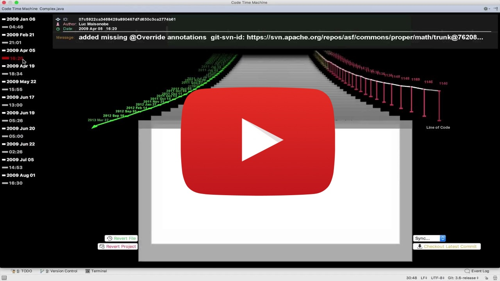

# Code Time Machine
The **Code Time Machine** is a lightweight IntelliJ IDE plugin which uses visualization techniques to depict the history of any chosen file augmented with information mined from the underlying versioning system. Inspired by Apple’s Time Machine, this tool allows both developers and the system itself to seamlessly move through time.

Read more about the tool and its use-cases at ["The Code Time Machine" paper](http://www.inf.usi.ch/phd/aghajani/resources/papers/agha2017a.pdf), published at International Conference on Program Comprehension (ICPC) 2017, by [Emad Aghajani](http://www.inf.usi.ch/phd/aghajani), [Andrea Mocci](http://www.inf.usi.ch/postdoc/mocci), [Gabriele Bavota](http://www.inf.usi.ch/faculty/bavota) and [Michele Lanza](http://www.inf.usi.ch/faculty/lanza).

## Screenshots

## Code Time Machine In Action
A short video which demonstrates how the tool works in practice:

## Installation
### Binary
To install using pre-built  binary, first download [the latest release](https://github.com/Emadpres/CodeTimeMachine/releases/latest). Then, go to `IntelliJ IDE | Preference | Plugin | install plugin from Hard`.

### Source code
- **Using in-project IDEA project files**:
After cloning and opening the project via IntelliJ IDEA, you need to follow [Setting Up a Development Environment](./docs/setup-and-deploy.md#i-setting-up-a-development-environment) section. Afterwards, create a new `Run | Edit Configuration | + | Plugin` and use the newly created *IntelliJ Platform SDK* as the SDK (requires Java 1.8+).
- **Creating the project from scratch**:
Follow both [Setting Up a Development Environment and Creating a Plugin Project](./docs/setup-and-deploy.md#i-setting-up-a-development-environment) steps and copy relevant files (sources, resources, ...) to corresponding folders in your own project. (Please open an [issue](https://github.com/Emadpres/CodeTimeMachine/issues) if you face any issue)

In the end, deploy the project by following the [Deploying a Plugin](./docs/setup-and-deploy.md#deploying-a-plugin) section.

## Keyboard short keys
- `Q` : Switch between information display modes
- `V` : Toggle displaying code metrics values
- `T` : Toggle authors colorful mode
- `B`/`N`: mark first/second file to compare
- `Space` : compare two currently marked commits
- `,` : Show list of files which are changed in current commit
- `.` : Show list of all files in all packages
- `+`/`-` : Zoom in/out the timeline
- `A`/`D` : Select previous/next month on timeline
- `W`/`S` : Move to previous/next commit on 3D view
- `I`/`K` : Increase/Decrease maximum depth of visibility on 3D view
- `O`/`L` : Increase/Decrease commits windows distance on 3D view
- `Z`/`X` : Display previous/next code metric
- `F` : Toggle Commit List view between normal and tree mode.

## Issues
For known issues, please check [the issues](https://github.com/Emadpres/CodeTimeMachine/issues).