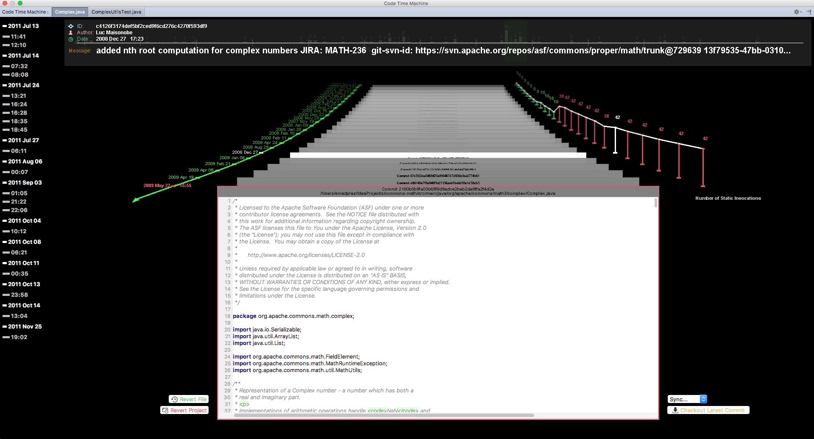
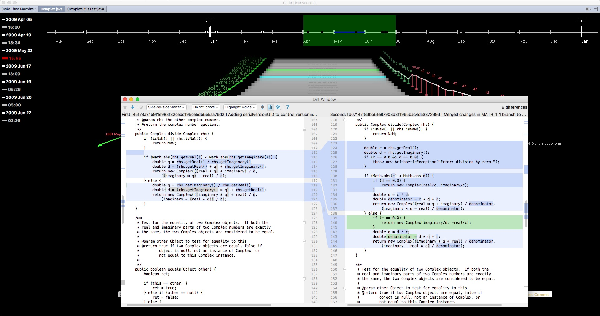

# Code Time Machine
The *Code Time Machine* is a lightweight IntelliJ IDE plugin which uses visualization techniques to depict the history of any chosen file augmented with information mined from the underlying versioning system. Inspired by Apple’s Time Machine, this tool allows both developers and the system itself to seamlessly move through time.

## Screenshots

## Code Time Machine In Action
A short video which demonstrates how the tool works in practice:

## Installation
### Binary
To install using pre-built  binary, first download [the latest release](https://github.com/Emadpres/CodeTimeMachine/releases/latest). Then, go to IntelliJ IDE > Preference > Plugin > install plugin from Hard.

### Source code
First clone the project. Follow the [Setting Up a Development Environment](http://www.jetbrains.org/intellij/sdk/docs/basics/getting_started.html) guideline to setup the IntelliJ IDE for plugin development. Now you should be able to compile the project (requires Java 1.8+) and run it. In the end, deploy the project by following the [Deploying a Plugin](http://www.jetbrains.org/intellij/sdk/docs/basics/getting_started/deploying_plugin.html) tutorial.

## Keyboard short keys
- `Q` : Switch between information display modes
- `V` : Toggle displaying code metrics values
- `T` : Toggle authors colorful mode
- `B`/`N`: mark first/second file to compare
- `Space` : compare two currently marked commits
- `,` : Show list of files which are changed in current commit
- `.` : Show list of all files in all packages
- `+`/`-` : Zoom in/out the timeline
- `A`/`D` : Select previous/next month on timeline
- `W`/`S` : Move to previous/next commit on 3D view
- `I`/`K` : Increase/Decrease maximum depth of visibility on 3D view
- `O`/`L` : Increase/Decrease commits windows distance on 3D view
- `Z`/`X` : Display previous/next code metric
- `F` : Toggle Commit List view between normal and tree mode.

## Issues
For known issues, please check [the issues](https://github.com/Emadpres/CodeTimeMachine/issues).
